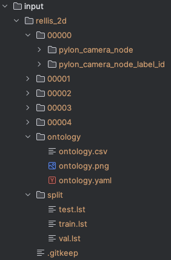
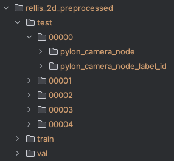

# WildSemiFusion
This project creates an extension of WildFusion [[1]](#1) that combines the original MultiModal 
model with domain experts (color expert, semantic expert). In addition, it has 
converted the 3D model to a 2D model that predicts color and semantics based off of gray and RGB 
images from the Rellis-3D dataset. Note, the codebase began as a fork of the 
WildFusion repository, so many files have similar structures.


## Dataset
You should have the following directory structure after following the first two steps

<p align="center">
  
  
</p>

### Downloading Rellis Dataset
The ontology and split for Rellis-3D RGB images and annotations are already provided in the 'input/rellis_2d' folder.
Download the following datasets from Rellis-3D and place their contents them in the 'input/rellis_2d' folder. 
### Preprocessing Rellis Dataset
Run the following command from the project directory to preprocess resizing images, synchronizing images to labels,
and splitting the dataset into train, validation, and test sets.
You can optionally set `--input_dir`, `--output_dir`, and `--split_dir` flags. These flags default to `<WildSemiFusion 
Directory>/input/rellis_2d`,
`<WildSemiFusion Directory>/input/rellis_2d_preprocessed'`, and `<WildSemiFusion Directory>/input/rellis_2d/split>` respectively.


```bash
python3 -m src.data.preprocess_rellis_2d
```
### Processing Rellis Dataset
Commands in `src/data/utils` are being used to create LAB and grayscale copies of an RGB image and to generate noise 
masking in the custom dataloader at `src/data/dataloader_rellis_2d.py`. This dataloader will be ran in the main.py, but
parameters are available at config.py.


## Training

## Testing
### Metrics
The following metrics can be calculated for all the complete models over the test 
dataset,
- MSE for color predictions
- MAE for color predictions
- PSNR for color predictions
- Accuracy for semantic predictions
- Precision for semantic predictions
- Recall for semantic predictions
- F1 for semantic predictions
- IoU for semantic predictions

To get color and semantic segmentation metrics per model, run the following commands,

For the base model,
``` 
python -m evaluation.test_base_model
```
For the Color models which combine the base model and the color expert. Use 
the `--model` flag to specify the combination type. 
```
python -m evaluation.test_color_model --model <simple|linear|mlp>
```
For the SemanticColor Models which combine the base model with color and 
semantic experts. Use the `--model` flag to specify the type. 
```
python -m evaluation.test_semantic_model --model <simple|linear|mlp>
```

In addition, the 

### Visualization
TODO

## Not sorted
You must apt-get install libglvnd-dev


## References
<a id="1">[1]</a> 
Y. Liu and B. Chen, “Wildfusion: Multimodal implicit
3d reconstructions in the wild,” 2024. [Online]. Available:
https://arxiv.org/abs/2409.19904